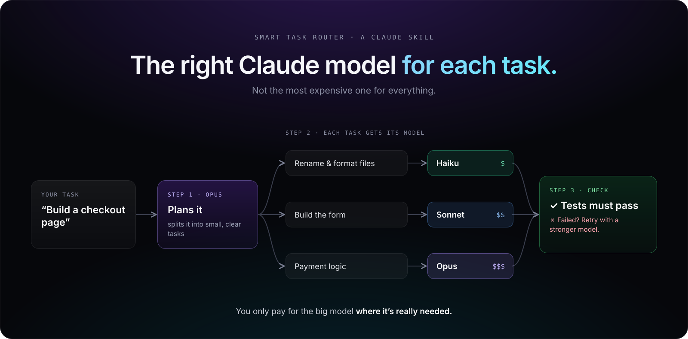

# Smart Task Router for Claude



**The strong model thinks, cheap models do the typing, and real checks decide.**

Most work doesn't need the biggest Claude model on max effort. This skill makes Claude pick the cheapest model and effort that can do **each part** of a task. Every part is verified, and Claude moves to a stronger model only when a check fails.

| Approach | How it works | Cost |
|---|---|---|
| Max everything | Biggest model, max effort, every task | $$$$$ |
| Manual | You switch models by hand | $$ |
| Escalate | Cheapest model first, verify, then move up | $ |
| **Router (this repo)** | A plan picks model + effort per subtask, verifies, escalates on fail | **¢** |

## What it does

**Small tasks (quick path):** Claude writes a tight spec, sends it to Haiku or Sonnet, runs the check itself, and moves one tier up only if the check fails.

**Big projects (project path):**

1. **Recon:** Haiku maps the codebase once into `.router/CONTEXT.md`.
2. **Plan:** Opus writes `.router/PLAN.md` with acceptance criteria, **contracts first** (API shapes, schema, signatures) and small tasks. Each task has a tier and a done-check. You approve the plan before anything is built.
3. **Build:** each task goes to the cheapest fitting agent with only the context it needs. Claude verifies every task and commits it as a checkpoint.
4. **Re-plan, don't brute-force:** if a task fails twice on Opus, the plan for that part gets fixed instead.
5. **Review:** Opus reviews the diff against the acceptance criteria, and its findings come back as new tasks.

Progress is saved in `.router/PROGRESS.md`, so in a new session just say *"continue the project"*.

| Tier | Agent | Model / effort | For |
|---|---|---|---|
| E | `router-easy` | Haiku · low | Boilerplate, renames, conversions, copying a pattern |
| N | `router-normal` | Sonnet · medium | Standard features inside defined contracts |
| H | `router-hard` | Opus · high | Planning, core logic, hard bugs, security, review |
| X | (override) | Fable · high | Only after Opus fails twice |

## Install

### Claude Code (recommended: includes the agents with effort settings)

```
/plugin marketplace add celiktech24-cell/smart-task-router
/plugin install smart-task-router@smart-task-router
```

### Claude Code, manual install

```bash
git clone https://github.com/celiktech24-cell/smart-task-router
cp -r smart-task-router/skills/smart-task-router ~/.claude/skills/
cp smart-task-router/agents/*.md ~/.claude/agents/
```

### Claude app (claude.ai, desktop, Cowork)

Download `smart-task-router-skill.zip` from the [Releases](../../releases) page and upload it in the Skills section of Claude's settings. The skill runs there too, but only Claude Code supports the agent files, so effort control is Claude Code only.

## Use it

Just ask for the task:

> Use smart-task-router: add a customer loyalty points system to this app.

> Fix the failing checkout tests.

> Continue the project.

At the end, Claude tells you the tier mix, e.g. `12 tasks: 5 E, 5 N, 2 H, 1 escalation`.

## Why low effort is often enough

Effort buys thinking time. A clear spec does that thinking up front, so with a good plan and contracts, most tasks run fine on a cheaper model at low effort. The plan is where the expensive thinking goes, and it is done once.

## Customize

- Change the models or effort levels in `agents/*.md`.
- Change the tier rules in `skills/smart-task-router/SKILL.md`.
- Add `.router/` to your project's `.gitignore` if you don't want to commit the plan files.

## License

MIT
